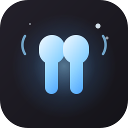

<p align="center">
  
</p>

<h1 align="center">auris</h1>

<p align="center">airpods for <a href="https://github.com/AvengeMedia/DankMaterialShell">dankmaterialshell</a></p>

<p align="center">
  <a href="https://github.com/z89/auris/stargazers"></a>
  <a href="https://github.com/z89/auris/commits/main"></a>
  <a href="LICENSE"></a>
  
</p>

a pair of headphones on the bar, a small panel, and it all shows up on its own when the airpods connect.

two halves in one repo: the plugin at the top, and `aurisd` under [daemon](daemon), the bit that actually talks to the airpods. no root, no patched bluez, no pretending to be a mac.

## install

the daemon first. it is on the aur, built from the `daemon` directory here:

```sh
yay -S aurisd-git
systemctl --user enable --now aurisd
```

no aur? `cargo install --path daemon` and the unit from `daemon/dist`. the [daemon readme](daemon/README.md) has the long version.

then the plugin:

```sh
git clone https://github.com/z89/auris ~/.config/DankMaterialShell/plugins/auris
dms ipc call plugins enable auris
```

and drop `auris` onto a bar under settings, bar, widgets. no restart needed.

## use

the pill keeps out of the way until the airpods connect. then it shows the lower of the two buds, and the panel opens for a few seconds so you can see the lot.

left click the pill for the panel. right click flips between anc and transparency.

- **left, right, case**, a bar and a number each. a bud that is out of your ear dims
- **noise control**: off, anc, transparency, adaptive. adaptive gets a slider
- **conversational awareness**, on or off
- **reconnect**, when the link is down

there is a control center tile too.

the case only reports while the buds sit in it. once they are out, its last level stays on the panel, dimmed, with how long ago it was seen. open the lid once and you have a number that sticks. the bar never shows an old number, only the panel does.

## settings

under settings, plugins, auris.

- **show percent** on the pill
- **pill shows** buds, all, left, right or case
- **low** and **critical** thresholds for the colour
- **hide when disconnected**, on by default
- **show stats when airpods connect** and for how long

## needs

- aurisd running as a user service
- dms 1.6 or newer
- tested on arch with bluez 5.87. anything with bluez 5 and a systemd user session should be fine

## the daemon

`aurisd` opens an aap link to the airpods next to the audio one, the same protocol a mac or iphone uses, and writes what it hears to `$XDG_RUNTIME_DIR/aurisd/state.json`. the `auris` cli sends commands back:

```sh
auris status
auris noise transparency
auris ca off
```

the state file is plain json, so anything else can read it too. the [daemon readme](daemon/README.md) covers the file, the cli, the config and the protocol.

## notes

the plugin has no bluetooth code of its own. it watches the state file and runs the `auris` cli for the buttons, so `auris status` in a terminal and the panel always agree.

pill says the daemon is missing? `systemctl --user status aurisd`. it looks in `~/.local/bin` as well as `PATH`, so a cargo install works too.

connected but no numbers? the daemon needs a few seconds after the bluetooth link comes up. still nothing after that, `journalctl --user -u aurisd` says what the airpods answered.

## license

mit
