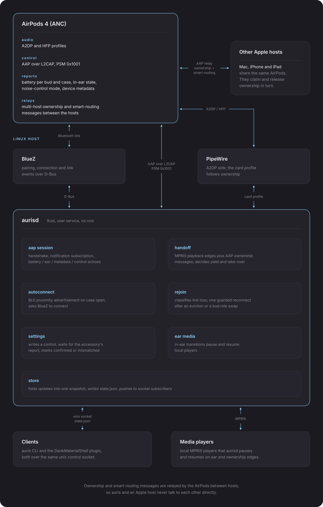
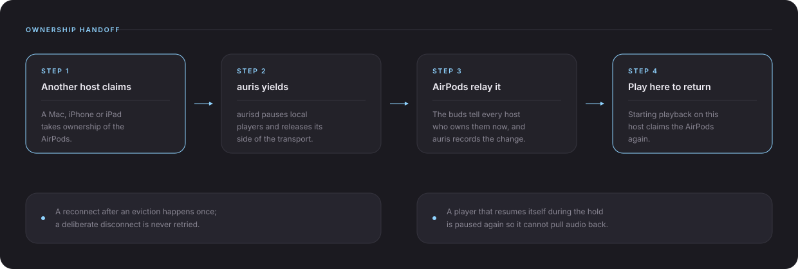
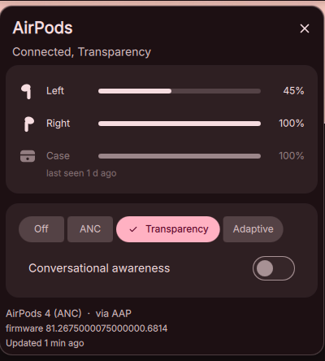

<h1 align="center">auris</h1>

<p align="center">a native AirPods stack for Linux: the Apple Accessory Protocol, multi-host ownership handoff, in-ear control and verified settings, in one rootless user service</p>

<p align="center">
  <a href="https://github.com/z89/auris/stargazers"></a>
  <a href="https://github.com/z89/auris/commits/main"></a>
  <a href="LICENSE"></a>
  
  
</p>

`aurisd` is a Rust daemon that speaks the Apple Accessory Protocol (AAP) to AirPods over the L2CAP control channel on PSM 0x1001, the channel Apple's own hosts use. it completes the Apple handshake, subscribes to the accessory's notifications and decodes them: battery per bud and case, in-ear state, noise-control mode and adaptive level, conversational awareness, device metadata and firmware, and the multi-host ownership and smart-routing messages the AirPods relay between hosts.

with Apple's Bluetooth vendor id presented by BlueZ, the AirPods treat this machine as an Apple host and run the same proximity-pairing ownership exchange they run with a Mac or an iPhone. auris takes part in that exchange rather than imitating it. a claim from another host is answered by stopping local playback and releasing this side of the A2DP transport before ownership moves; a local play edge sends the take-over request and pulls the stream back. the ACL link and both audio profiles stay connected across a switch, so the cost is a profile change rather than a disconnect, a page and a re-pair.

the rest of the daemon is built on the same reports. in-ear transitions drive local players over MPRIS, so a bud out of the ear pauses and a bud back in resumes. a setting write is not treated as a result: the value is read back from the accessory's own report before the CLI or the panel calls it confirmed. the link repairs itself after an eviction by another host, a primary-bud role switch or a dropped ACL, and opening the case is enough to connect, from the proximity advertisement rather than from a scan.

all of it runs as an unprivileged systemd user service on stock BlueZ and PipeWire. no kernel patch, no forked Bluetooth stack, no root, no vendor daemon. one snapshot is published as line-delimited JSON on a unix socket and as an atomic state file, so the CLI, the live panel and anything else read identical state.

> tested on arch linux with BlueZ 5.87, PipeWire 1.6.8 and WirePlumber, against AirPods 4 (ANC), model id `0x201B`, with a Mac on macOS Tahoe 26.6.2 as the second host. other AirPods models, other BlueZ versions and other distributions are untested.

## ✨ highlights

- 🔄 **multi-host handoff**: yields to a Mac, iPhone or iPad on its ownership claim and takes the AirPods back on a local play edge, over the accessory's control channel, with both profiles left up.
- 👂 **in-ear control**: removing a bud pauses local players and putting it back resumes what auris paused, driven by the accessory's own in-ear reports.
- 🩹 **self-healing link**: evictions, primary-bud role switches and dropped links are classified from Bluetooth events and recovered once each, and a disconnect you made yourself is never redialled.
- 📦 **auto-connect on case open**: the case's BLE proximity advertisement triggers the connect, with a paging path for adapters that miss the advert.
- ✅ **verified settings**: noise control, conversational awareness, adaptive level, press speed, hold duration, call controls, personalized volume and rename are confirmed from the accessory's own report; microphone side and the listening-mode cycle are sent but carry no confirming report on this firmware.
- 🧰 **cli and plain JSON**: `auris` drives every control from a shell, and `state.json` plus the control socket expose the whole snapshot to other tools.
- 🎛️ **live panel**: an optional desktop frontend for the same socket, pushed from the daemon rather than polled.

## 📦 install

`aurisd` builds from the `daemon` directory with Rust 1.85 or newer and runs as a systemd user service.

```sh
cargo install --path daemon
mkdir -p ~/.config/systemd/user
sed 's#/usr/bin/aurisd#%h/.cargo/bin/aurisd#' daemon/dist/aurisd.service > ~/.config/systemd/user/aurisd.service
systemctl --user daemon-reload
systemctl --user enable --now aurisd
```

that is the whole install. `auris status` should print the accessory within a few seconds of the AirPods connecting. the [daemon readme](daemon/README.md) documents every command, flag and config key; the [live panel](#-live-panel) is optional and installs separately.

## 📊 feature matrix

rows are checked against [LibrePods' latest README](https://github.com/librepods-org/librepods/blob/main/README.md).
the annotated version is in [feature comparison](docs/FEATURE_COMPARISON.md).

| Symbol | Meaning |
| ------ | ------- |
| ✅ | Implemented and works well |
| ⚪ | Needs VendorID spoofing; use at your own risk |
| 🔴 | Not implemented yet; planned |
| ⛔ | Will not be implemented |
| ❓ | Unknown |

| Feature | LibrePods (Linux) | auris | note |
|---|---|---|---|
| Changing Listening Mode | ✅ | ✅ | off, anc, transparency, adaptive |
| Ear detection | ✅ | ✅ | live left and right state in daemon, cli and ui |
| Battery status | ✅ | ✅ | per bud and case, charging, freshness, last-known cache |
| Renaming AirPods | ✅ | ✅ | read back from the accessory's own metadata |
| Loud Sound Reduction | 🔴 | 🔴 | neither side has it on linux |
| Head Gestures | ⛔ | ⛔ | no linux path, same reason LibrePods gives |
| Conversational Awareness | ✅ | ✅ | control plus the 0x004B event |
| Automatically connect to AirPods | ✅ | ✅ | pages over ble on case opening, on by default |
| Hearing Aid | 🔴 | 🔴 | neither side has it on linux |
| Transparency Mode customization | 🔴 | 🔴 | adaptive strength only, not the full set |
| Multi-device connectivity (Bluetooth Multipoint; 2 devices only) | ⚪ | ⚪ | two live hosts with ownership handoff, after an Apple `DeviceID` in BlueZ and one re-pair |
| Other accessibility configs | 🔴 | see rows below | LibrePods ships these on android only |
| ... Press speed | 🔴 | ✅ | auris only on linux, physical timing not accepted yet |
| ... Press and Hold duration | 🔴 | ✅ | auris only on linux, physical timing not accepted yet |
| ... Noise Cancellation with single AirPod | 🔴 | 🔴 | no verified public command, see [per-bud control](docs/PER_BUD_CONTROL_RESEARCH.md) |
| ... Volume control on swipe | 🔴 | 🔴 | neither side has it on linux |
| ... Volume swipe speed | 🔴 | 🔴 | neither side has it on linux |
| Other general configs | 🔴 | see rows below | LibrePods ships these on android only |
| ... Press and Hold to cycle between listening modes / invoke digital assistant (invoking digital assistant needs a recent firmware) | 🔴 | ❓ | cycle is sent, no device report confirms it |
| ... Configure call controls | 🔴 | ✅ | auris only on linux, call behaviour not accepted yet |
| ... Personalized volume | 🔴 | ✅ | auris only on linux, audio effect not accepted yet |
| ... Loud Sound Reduction (needs VendorID spoofing) | 🔴 | 🔴 | neither side has it on linux |
| ... Microphone side | 🔴 | ❓ | sent, no device report confirms it |
| ... Pause media when falling asleep (needs a recent firmware) | 🔴 | 🔴 | neither side has it on linux |
| ... Enable `Off listening mode` to switch to `Off` | 🔴 | ✅ | off is one of the four selectable modes |
| Head-tracked Spatial Audio | ❓ | 🔴 | needs audio-stack work beyond this project |
| Heart Rate Monitoring | ⛔ | ⛔ | AirPods 4 (ANC) has no heart rate sensor |
| Find My | ❓ | 🔴 | needs protocol and security work beyond this project |
| High quality two-way audio | 🔴 | 🔴 | neither side has it on linux |
| Auto play/pause on ear detection | ✅ | ✅ | a bud out of the ear pauses local players, a bud back in resumes |
| Seamless handoff between hosts | ✅ | ✅ | ownership exchange over the accessory's control channel |

## 🏗️ architecture

<p align="center"></p>

the AirPods expose two links to every host: the audio profiles BlueZ and PipeWire already handle, and the AAP control channel on L2CAP PSM 0x1001. `aurisd` opens that control channel alongside the audio link, performs the Apple handshake, and subscribes to notifications. everything the CLI and the panel show comes from those notifications, never from inference about the audio stream.

the daemon is a set of small modules over one shared snapshot:

- **aap session** owns the L2CAP socket, the handshake, the notification subscription, and the parsing of battery, ear, metadata and control echoes.
- **handoff** combines MPRIS playback edges with the accessory's ownership messages and decides when to yield and when to claim.
- **autoconnect** matches the case's BLE proximity advertisement and asks BlueZ to connect.
- **rejoin** classifies a lost link from Bluetooth events and reconnects when the cause was another host or a bud role switch.
- **settings** writes a control, waits for the accessory's report, and marks the value confirmed or mismatched.
- **ear media** turns in-ear transitions into pause and resume commands for local players.
- **store** folds every update into one snapshot, writes `state.json` atomically, and pushes changes to socket subscribers.

clients hold no Bluetooth code. they subscribe to the socket, read the state file, and send commands back over the same socket, so `auris status` and any frontend cannot disagree.

## 🔄 multi-host handoff

handoff is opt-in and works with any Mac, iPhone or iPad paired to the same AirPods.

<p align="center"></p>

Apple hosts only exchange ownership with a peer that presents Apple's Bluetooth vendor id, so BlueZ needs that id set once, and the AirPods need pairing again afterwards.

```sh
sudo sed -i 's/^#ReconnectAttempts=7/ReconnectAttempts=0/' /etc/bluetooth/main.conf
sudo sed -i '/^\[General\]/a DeviceID = bluetooth:004C:0000:0000' /etc/bluetooth/main.conf
sudo systemctl restart bluetooth
bluetoothctl remove <airpods address>   # then pair again
auris handoff on
```

with that in place the exchange runs over the accessory, in a fixed order. a claim from another host pauses the local players, waits for the stream to actually stop, sets the AirPods' PipeWire card profile to `off` so the A2DP transport is released from this side, and only then sends the ownership release. playback ends rather than being handed to another sink, and the accessory is never given up while a transport is still open under it. a player that resumes itself during the hold is paused again, so an autoplaying tab cannot drag the audio back. when something plays here and the other host is not on a call, auris sends the claim and the stream returns. the ACL link and both profiles stay connected the whole time.

`auris handoff status` reports who owns the accessory and where audio is routed. `auris take-over` and `auris yield` force either direction. setting `take_over_on_play = false` under `[handoff]` in `~/.config/aurisd/config.toml` keeps the automatic yield and leaves the claim manual. `bt_name` in the same section is the name the Mac shows in its banner when it loses the AirPods.

the protocol itself, the opcodes and the observed behaviour of each host are in [Apple multi-host switching](docs/BATTERY_AND_HANDOFF.md#apple-multi-host-switching).

## 👂 in-ear control

the accessory reports in-ear state per bud, and auris acts on it over MPRIS. taking a bud out pauses every local player that is playing, and putting it back in resumes the player auris paused. a pause you made yourself is never undone, nothing resumes while another host owns the AirPods, and transient reports during a case open or a bud role switch are settled before anything is sent.

three keys under `[ear]` in `~/.config/aurisd/config.toml` control it: `auto_pause`, `auto_resume`, and `pause_on_one_of_two`, which decides whether removing one bud of a pair pauses immediately, as macOS does, or whether the pause waits for the second bud. all three default to on.

## ⚙️ settings and verification

writes go out as AAP control commands and are judged by what comes back.

- confirmed by the accessory's report: noise control, conversational awareness, adaptive level, press speed, hold duration, call controls, personalized volume, and rename, which is read back from the device metadata after the link reopens.
- sent but unconfirmed on this firmware: microphone side and the listening-mode cycle. the CLI and the panel label them unconfirmed rather than failed.
- the audible effect of a setting is a separate question from the write path; the write path is what auris can prove.

## 🖥️ cli reference

`auris` talks to the daemon over the control socket and exits non-zero when the daemon is unreachable or the accessory rejects a command.

| command | arguments | what it does |
|---|---|---|
| `auris status` | `--json` | current snapshot, as a summary or the raw `state.json` object |
| `auris noise` | `anc`, `transparency`, `adaptive`, `off` | set the listening mode |
| `auris ca` | `on`, `off` | conversational awareness |
| `auris adaptive` | `0`-`100` | adaptive transparency strength |
| `auris setting` | `<key> <json-value>` | any typed setting, for example `auris setting microphone '"left"'` |
| `auris rename` | `<name>` | rename the accessory, then confirm from its metadata |
| `auris handoff` | `on`, `off`, `status` | multi-host switching |
| `auris take-over` | | claim the AirPods from another Apple host now |
| `auris yield` | | give them up to another Apple host now |
| `auris reconnect` | | drop and re-establish the AAP control link only |
| `auris connect-once` | | ask BlueZ once to connect the pinned device; never retried automatically |

`--runtime-dir <PATH>` is global and overrides `$XDG_RUNTIME_DIR/aurisd`. `-h` and `-V` behave as usual.

the daemon takes three flags:

| flag | what it does |
|---|---|
| `--runtime-dir <PATH>` | override the runtime directory |
| `--device <BD_ADDR>` | pin to one accessory instead of auto-detecting |
| `--dump-schema` | print an example `state.json` and exit |

`~/.config/aurisd/config.toml` holds the rest: the pinned device, the primary bud, and the `[handoff]`, `[autoconnect]`, `[ear]` and `[ble]` sections. every key and default is documented in the [daemon readme](daemon/README.md).

## 🎛️ live panel

the panel is a [DankMaterialShell](https://github.com/AvengeMedia/DankMaterialShell) plugin and is optional; auris is complete from the CLI. it subscribes to the daemon's socket, so it reflects battery, ear state and link changes as they arrive.

<p align="center">
  
  &nbsp;&nbsp;&nbsp;
  
</p>

```sh
git clone https://github.com/z89/auris ~/.config/DankMaterialShell/plugins/auris
dms ipc call plugins enable auris
```

add `auris` to a bar under settings, bar, widgets. no shell restart is needed.

- the pill shows battery and hides charging buds from its figure, since a charging level says nothing about what is in your ears. left click opens the panel, right click toggles anc and transparency.
- the panel carries left, right and case levels, the listening modes with the adaptive slider, conversational awareness, and a setup section behind the chevron for renaming, microphone side, press speed, hold duration, the mode cycle, call controls and personalized volume.
- readings that stop arriving are kept and marked stale rather than dropped, and historical charging is never shown as a live measurement.
- while a link is healing the widget stays on the bar with dimmed readings and an attempt count; any other disconnect is held briefly so a quick rejoin does not blink the module out.
- plugin options live under settings, plugins, auris: percentage on the pill, which cells the pill summarises, the low and critical thresholds, and whether the module hides when the AirPods are away.

## ✅ requirements

- linux with systemd user sessions, BlueZ 5 and PipeWire.
- Rust 1.85 or newer to build.
- DankMaterialShell 1.6 or newer, for the optional panel.

## 🩺 troubleshooting

if the CLI or the panel reports the daemon missing, check `systemctl --user status aurisd`. a cargo install lands in `~/.cargo/bin`, and the plugin also looks in `~/.local/bin`.

if the AirPods are connected but nothing reports, give the daemon a few seconds after the Bluetooth link comes up, then read `journalctl --user -u aurisd`, which logs what the accessory answered.

if handoff does nothing, confirm the `DeviceID` line is in `/etc/bluetooth/main.conf` and that the AirPods were paired again after it was added. without it the AirPods will not exchange ownership with this host.

## 📚 documentation

- [daemon, cli and config](daemon/README.md): every command, flag, config key, the state file and the control socket.
- [battery and handoff](docs/BATTERY_AND_HANDOFF.md): telemetry, freshness, the ownership protocol and the audio route.
- [protocol evidence](docs/PROTOCOL_EVIDENCE.md): opcodes, control identifiers and what each report proves.
- [feature comparison](docs/FEATURE_COMPARISON.md): the annotated matrix.
- [feature roadmap](docs/FEATURE_ROADMAP.md): what is implemented, what is blocked and why.
- [mac agent and gestures](docs/MAC_AGENT_AND_GESTURES_RESEARCH.md): Apple-side limits, keychain boundaries and motion gestures.
- [per-bud control](docs/PER_BUD_CONTROL_RESEARCH.md): what is known about single-bud controls.

## 📄 license

mit
